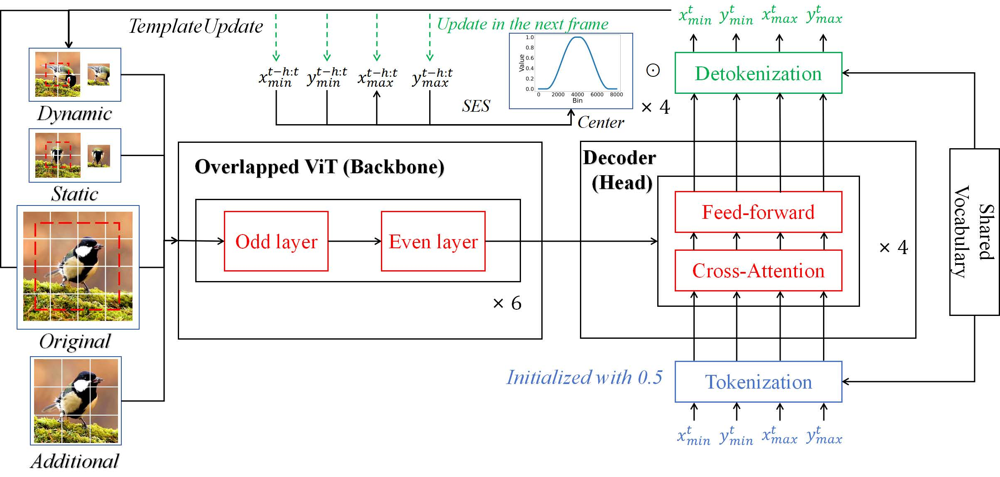

# OTETrack

**Overlapped Trajectory Enhanced Visual Tracking**

Manuscript has been submitted to IEEE TCSVT

GitHub maintainer: [Li Shen](https://github.com/OrigamiSL)

E-mail: shenli@buaa.edu.cn

Model Architecture
---------



Abstract
------------------

This work proposes **OTETrack**, a visual tracker with **Overlapped** feature extraction and interpretable **Trajectory-related Enhancement**. Instead of directly taking existing backbone, e.g., ViT, as the feature extractor, we ameliorate the non-parametric parts of ViT to render it tailored for tracking, thus proposing Overlapped ViT which owns an appropriate trade-off between capability and efficiency. The patches in Overlapped ViT are refined to be overlapped with each other, whereas their interactions are devised to be partial but sufficiently global. Moreover, different from other trajectory-related trackers, we incorporate Hanning window, into the trajectory prediction. Instead of utilizing Hanning window mechanically, we revamp it to render it acclimatizing to the non-stationary tracking circumstances with quick motion and time-varying target status, where the conventional method fails to handle. OTETrack achieves state-of-the-art performances on seven benchmarks compared with thirteen existing cutting-edge baselines.

Performance
----------------------

|            Benchmarks              |       OTETrack-256       |  
|:-------------------------------:|:-----------------------:|
| GOT-10k (AO / SR 0.5 / SR 0.75) |   76.4	/ 85.4	/ 75.1  |  
|    LaSOT (AUC / Norm P / P)     |   73.9	/ 83.5	/ 82.3
| TrackingNet (AUC / Norm P / P)  |   84.8 / 89.3 / 83.9    |  
|  LaSOT_ext (AUC / Norm P / P)   |   51.9 / 62.3 / 59.2    |     
|          UAV123 (AUC)           |          70.8           |     

Inference Speed
---------------

Our baseline model (backbone: Overlapped ViT-B, resolution: 256x256) can run at **163 fps** (frames per second) on a single NVIDIA GeForce RTX 4090.

## Install the environment

We use the Anaconda (**CUDA 11.3**) to build the environment (**Linux**).
Before you run our project, we suggest that you install and activate the environment by running the commands below. 
```
conda env create -f OTETrack_env_cuda113.yaml

conda activate otetrack
```
Partial paramount site-packages requirements are listed below:
- `python == 3.9.7` 
- `pytorch == 1.11.0`
- `torchvision == 0.12.0`
- `matplotlib == 3.5.1`
- `numpy == 1.21.2`
- `pandas == 1.4.1`
- `pyyaml == 6.0`
- `scipy == 1.7.3`
- `scikit-learn == 1.0.2`
- `tqdm == 4.63.0`
- `yaml == 0.2.5`
- `opencv-python == 4.5.5.64`
## Data
GOT-10k dataset can be acquired at: [GOT-10k](http://got-10k.aitestunion.com/downloads).
LaSOT dataset can be acquired at: [LaSOT](https://onedrive.live.com/?authkey=%21AMZfYsa%2DWN%5Fd6lg&id=83EEFE32EECC7F4B%2133324&cid=83EEFE32EECC7F4B&parId=root&parQt=sharedby&o=OneUp).
TrackingNet dataset can be acquired at: [TrackingNet](https://drive.google.com/drive/u/0/folders/1gJOR-r-jPFFFCzKKlMOW80WFtuaMiaf6).
LaSOTEXT dataset can be acquired at: [LaSOTEXT](https://onedrive.live.com/?authkey=%21AL6OYePAAteZeuw&id=83EEFE32EECC7F4B%2133323&cid=83EEFE32EECC7F4B&parId=root&parQt=sharedby&o=OneUp).
UAV123 dataset can be acquired at: [UAV123](https://drive.google.com/file/d/0B6sQMCU1i4NbNGxWQzRVak5yLWs/view?resourcekey=0-IjwQcWEzP2x3ec8kXtLBpA).
## Data Preparation

After you acquire and unzip the raw data of all datasets, please separately place them in corresponding folders, e.g., putting the train split of LaSOT under `${LASOT_TRAIN_PATH}`. Notice that we test and evaluate NFS on its 30fps version, however the downloaded version is 120fps. Therefore, you need to sample the data via running the command below to get the needed NFS30:
```
python ./lib/test/evaluation/process_nfs.py --root_path ${NFS_PATH}
```
The file tree shall look like this:
```
    #Training Split:
    -- ${LASOT_TRAIN_PATH}
        |-- airplane
        |-- basketball
        |-- bear
        ...
    -- ${GOT10K_TRAIN_PATH}
        |-- train
    -- ${COCO_TRAIN_PATH}
        |-- annotations
        |-- images
    -- ${TRACKINGNET_TRAIN_PATH}
        |-- TRAIN_0
        |-- TRAIN_1
        ...
        |-- TRAIN_11
```
```
    #Testing Split:
    -- ${LASOT_TEST_PATH}
        |-- airplane-1
        |-- airplane-9
        |-- airplane-13
        ...
    -- ${GOT10K_TEST_PATH}
        |-- test
    -- ${TRACKINGNET_TEST_PATH}
        |-- TEST
    -- ${LASOTEXT_PATH}
        |-- atv
        |-- badminton
        |-- cosplay
        ...
    -- ${UAV_PATH}
        |-- anno
        |-- data_seq
```
## Set project paths and dataset paths

After you finish the data preparation, you are advised to modify project paths and dataset paths by editing these two files.
```
lib/train/admin/local.py  # paths about training
lib/test/evaluation/local.py  # paths about testing
```
The train path should look like this:
```
# paths about training
import os
class EnvironmentSettings:
    def __init__(self):
        project_path = os.path.dirname(os.path.dirname(os.path.dirname(os.path.dirname(os.path.abspath(__file__)))))

        # project path
        self.workspace_dir = project_path 
        self.tensorboard_dir = os.path.join(project_path, 'tensorboard')  
        self.pretrained_networks = os.path.join(project_path, 'pretrained_networks')  

        # dataset path
        self.lasot_dir = ${LASOT_TRAIN_PATH}
        self.got10k_dir = ${GOT10K_TRAIN_PATH}
        self.trackingnet_dir = ${TRACKINGNET_TRAIN_PATH}
        self.coco_dir = ${COCO_TRAIN_PATH}
```
The test path should look like this:
```
# paths about testing
from lib.test.evaluation.environment import EnvSettings
import os
# Set your local paths here.
def local_env_settings():
    settings = EnvSettings()

    # root path
    project_path = os.path.dirname(os.path.dirname(os.path.dirname(os.path.dirname(os.path.abspath(__file__)))))

    # dataset path
    settings.got10k_path = ${GOT10K_TEST_PATH} 
    settings.lasot_extension_subset_path = ${LASOTEXT_PATH}
    settings.lasot_path = ${LASOT_TEST_PATH}
    settings.trackingnet_path = ${TRACKINGNET_TEST_PATH}
    settings.uav_path = ${UAV_PATH}
    settings.network_path = os.path.join(project_path,'output/test/networks' )   # Where tracking networks are stored.
    
    # save path
    settings.prj_dir = project_path
    settings.result_plot_path = os.path.join(project_path,'output/test/result_plots') 
    settings.results_path = os.path.join(project_path,'output/test/tracking_results') 
    settings.save_dir = os.path.join(project_path,'output')  
    settings.segmentation_path = os.path.join(project_path,'output/test/segmentation_results' )
    
    return settings
```

## Create two folders to store weights
You should create two folders to store the weights for training or testing. We supply the command below to complete it:
```
python mkdirs.py
```
The created folders are put under the project path, which shall look like this:
```
   ${PROJECT_ROOT}
    |-- pretrained_models
    |-- test_checkpoint
```

## Weight sources (OTETrack_256_full and OTETrack_256_got):

You can download the model weights from [Google Drive](https://drive.google.com/file/d/1-9CceF4HwsudLi9pt5ylDEhYtrgGDhsz/view?usp=sharing) or [Baidu Drive](https://pan.baidu.com/s/1lJz4RlgCE8XW7lV3sXbcBw?pwd=25ur) (extracted code: 25ur).

Put the model weights you download in `./test_checkpoint.` The file tree shall look like this:
```
   ${PROJECT_ROOT}
    |-- test_checkpoint
    |   |-- OTETrack_all.pth.tar
    |   |-- OTETrack_got.pth.tar
```
## Raw results
You can download the raw results in `$PROJECT_ROOT$/raw_result.zip`. After you unzip the zipfile, the file tree shall look like this:
```
   ${PROJECT_ROOT}
    |-- raw_result
    |   |-- got10k_submit.zip
    |   |-- lasot.zip
    |   |-- lasotext.zip
    |   |-- trackingnet_submit.zip
    |   |-- uav.zip
```

## Download the pre-trained weight
Download pre-trained [MAE ViT-Base weight](https://dl.fbaipublicfiles.com/mae/pretrain/mae_pretrain_vit_base.pth) and put it under `$PROJECT_ROOT$/pretrained_models` 

## Train OTETrack

For full dataset training (GOT10K, LaSOT, TrackingNet, COCO)
```
python tracking/train.py --script otetrack --config otetrack_256_full --save_dir ./output --mode single --nproc_per_node 4 --use_wandb 0
```

For GOT10K training (GOT10K)
```
python tracking/train.py --script otetrack --config otetrack_256_got --save_dir ./output --mode single --nproc_per_node 4 --use_wandb 0
```

## Test and evaluate on benchmarks

For convenience, you can run the command below to test and evaluate all benchmarks. Notice that GOT10K is evaluated on [GOT10K](http://got-10k.aitestunion.com/) and TrackingNet is evaluated on [TrackingNet](https://eval.ai/web/challenges/challenge-page/1805/overview).

- Test all benchmarks

```
python lib/test/analysis/test_all.py

```
After you finish the process above, the raw result files for all the benchmarks will be saved under `$PROJECT_ROOT$/all_test_result` and the results will be recorded in `$PROJECT_ROOT$/all_test_result.txt`. The file tree shall look like this:

```
   ${PROJECT_ROOT}
    |-- all_test_result
    |   |-- got10k_test
    |   |-- lasot
    |   ...
    |-- all_test_result.txt
```

You can also test and evaluate each benchmark respectively by running the commands below:

- GOT10K-test
```
python tracking/test.py otetrack otetrack_256_got --dataset got10k_test --test_checkpoint ./test_checkpoint/OTETrack_got.pth.tar --threads 0 --num_gpus 1

python lib/test/utils/transform_got10k.py --tracker_name otetrack --cfg_name otetrack_256_got
```
- LaSOT
```
python tracking/test.py otetrack otetrack_256_full --dataset lasot --test_checkpoint ./test_checkpoint/OTETrack_all.pth.tar --threads 0 --num_gpus 1

python tracking/analysis_otetrack.py otetrack otetrack_256_full --dataset lasot 
```
- TrackingNet
```
python tracking/test.py otetrack otetrack_256_full --dataset trackingnet --test_checkpoint ./test_checkpoint/OTETrack_all.pth.tar --threads 0 --num_gpus 1

python lib/test/utils/transform_trackingnet.py --tracker_name otetrack --cfg_name otetrack_256_full
```
- LaSOText
```
python tracking/test.py otetrack otetrack_256_full --dataset lasot_extension_subset --test_checkpoint ./test_checkpoint/OTETrack_all.pth.tar --threads 0 --num_gpus 1

python tracking/analysis_otetrack.py otetrack otetrack_256_full --dataset lasot_extension_subset 
```

- UAV123
```
python tracking/test.py otetrack otetrack_256_full --dataset uav --test_checkpoint ./test_checkpoint/OTETrack_all.pth.tar --threads 0 --num_gpus 1

python tracking/analysis_otetrack.py otetrack otetrack_256_full --dataset uav
```

## Acknowledgement

This codebase is implemented on the following projects. We really appreciate their authors for the open-source works!

- [ARTrack](https://github.com/miv-xjtu/artrack) [[related paper](https://openaccess.thecvf.com/content/CVPR2023/papers/Wei_Autoregressive_Visual_Tracking_CVPR_2023_paper.pdf)]
- [SeqTrack](https://github.com/microsoft/VideoX/tree/master/SeqTrack) [[related paper](https://arxiv.org/abs/2304.14394)]

**This project is not for commercial use. For commercial use, please contact the author.**

## Citation

If any part of our work helps your research, please consider citing us and giving a star to our repository.

## Contact

If you have any questions or concerns, feel free to open issues or directly contact me through the ways on my GitHub homepage **provide below paper's title**.
